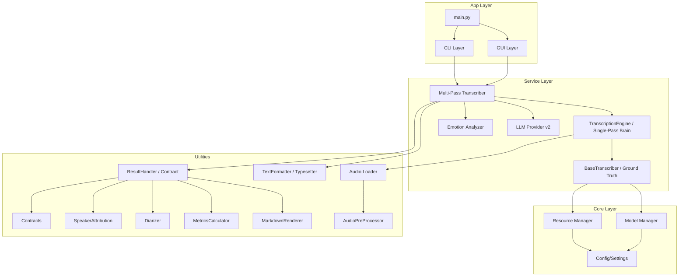

# Insightron Codebase Explorer

Welcome to the Insightron codebase! This document serves as a comprehensive guide for developers to understand the structure, concepts, and integration of the Insightron project. Whether you're a seasoned engineer or a newbie, this guide will help you navigate and iterate on the code.

## 🏗️ High-Level Architecture

Insightron is built with a modular, layered architecture that separates core logic from the user interface and external services.

---

## 📁 Directory Breakdown

### 1. `insightron/app/`
The entry point of the application. It orchestrates the startup process and handles both GUI and CLI interfaces.

- **`main.py`**:
  - **Use**: Main entry point for the application.
  - **Concept**: Initializes configurations, checks dependencies, and launches either the GUI or CLI batch processor.
  - **Integration**: Imports `InsightronGUI` from `app.gui` and `batch_transcribe_files` from `services.batch`.

### 2. `insightron/core/`
The backbone of the application, managing system resources, models, and configurations.

- **`config.py`**:
  - **Use**: Centralized configuration management.
  - **Concept**: Loads `config.yaml` and provides access to global settings.
  - **Integration**: Used by almost every other module to fetch parameters.
- **`model_manager.py`**:
  - **Use**: Manages the lifecycle of AI models (Whisper, etc.).
  - **Concept**: Handles model downloading, loading into memory (CPU/GPU), and unloading.
  - **Integration**: Called by `TranscriptionEngine` to get model instances.
- **`resource_manager.py`**:
  - **Use**: Monitors and optimizes system resource usage.
  - **Concept**: Ensures the application doesn't exceed memory limits, especially on low-spec machines.
  - **Integration**: Interacts with `ModelManager` to trigger garbage collection or model offloading.
- **`vad.py`**:
  - **Use**: Voice Activity Detection.
  - **Concept**: Filters out silence or non-speech segments before transcription to save compute.
  - **Integration**: Used by `TranscriptionEngine` for efficient processing.

### 3. `insightron/services/`
Contains the business logic for transcription and post-processing.

- **`base_transcriber.py`**:
  - **Use**: Ground Truth Layer — literal transcription with no cleanup.
  - **Concept**: Camera-like: preserves hesitations, repetitions, and uncertainty. Validates system resources before transcription.
  - **Integration**: Used by `TranscriptionEngine` as the lowest-level transcription interface.
- **`transcription/multi_pass_transcriber.py`**:
  - **Use**: Orchestrates the 3-pass transcription pipeline.
  - **Concept**:
    - **Pass 1**: Raw detection using Whisper (`TranscriptionEngine`).
    - **Pass 2**: Contextual restoration using an LLM (`LLMProvider`) with v2 philosophy.
    - **Pass 3**: Emotion mapping (`EmotionAnalyzer`) and optional speaker/structure passes.
  - **Integration**: Coordinates `TranscriptionEngine`, `LLMProvider`, `EmotionAnalyzer`, `TextFormatter`, and `ResultHandler`.
- **`transcription/transcription_engine.py`**:
  - **Use**: Single-Pass Brain — refines literal output into a stable first draft.
  - **Concept**: Handles signal processing and single-pass inference with ASR artifact deduplication.
  - **Integration**: Uses `BaseTranscriber` for literal ground truth, consumed by `MultiPassTranscriber`.
- **`transcription/llm_provider.py`**:
  - **Use**: Unified interface for local and cloud LLMs with v2 restoration philosophy.
  - **Concept**: Wraps providers (e.g. OpenAI, local Qwen) with prompt profiles (`thinking_session`, `meeting_notes`, `study_notes`), JSON response contract, and boundary stitching.
- **`transcription/emotion_analyzer.py`**:
  - **Use**: Computes emotion markers (e.g. `[Cheerful]`, `[Urgent]`).
  - **Concept**: Uses speech rate, lexical cues, and configuration thresholds.
- **`transcription/text_formatter.py`**:
  - **Use**: Deterministic formatting (paragraphs, bullets, named views).
  - **Concept**: Uses `FormattingView` dataclass with per-view sentence limits and LaTeX mode. Implements the "typesetter" role.
- **`transcription/contracts.py`**:
  - **Use**: Typed frozen dataclasses for pipeline data.
  - **Concept**: `SegmentData`, `WordTimestamp`, `TranscriptionMetrics`, `TranscriptionReport`, `DiarizationResult` for type-safe data flow.
- **`transcription/audio_preprocessor.py`**:
  - **Use**: 4-stage audio preprocessing pipeline.
  - **Concept**: Noise reduction (noisereduce), LUFS normalization (pyloudnorm), pre-emphasis filtering, and edge trimming.
- **`transcription/markdown_renderer.py`**:
  - **Use**: Dashboard-style Markdown reports.
  - **Concept**: Quality metrics table, speaker timeline, low-confidence flags, raw metadata JSON, file hash verification.
- **`transcription/metrics_calculator.py`**:
  - **Use**: Word-level and temporal quality metrics.
  - **Concept**: Computes confidence, speaking rate, vocabulary density, pause analysis, and language detection metrics.
- **`transcription/result_handler.py` & `markdown_renderer.py`**:
  - **Use**: Turn results into Markdown/other artifacts and write them safely.
  - **Concept**: Atomic writes, frontmatter, formatting profile resolution, dashboard/classic report styles.
- **`transcription/diarization.py`**:
  - **Use**: Optional pyannote speaker diarization wrapper.
  - **Concept**: Supports HF token auth, configurable speaker constraints, returns `DiarizationResult`.
- **`transcription/speaker_attribution.py`**:
  - **Use**: Maximum-overlap speaker labeling for ASR segments and words.
  - **Concept**: Assigns speaker labels from diarization turns to transcription segments.
- **`transcription/segment_analyzer.py`, `quality_metrics.py`**:
  - **Use**: Advanced quality metrics and adaptive segment merging.
  - **Concept**: Compute confidence tiers, degradation detection, and per‑segment stats.
- **`transcription/audio_loader.py`**:
  - **Use**: Robust loading, normalization, and preprocessing for all supported formats.
- **`batch/batch_processor.py`**:
  - **Use**: Handles processing of multiple files in parallel.
  - **Concept**: Uses thread/process pools plus state/resume support (`batch_state_manager.py`, `progress_tracker.py`).
  - **Integration**: Used by the CLI and GUI for "Batch Mode".

### 4. `insightron/ui/`
The presentation layer built with `CustomTkinter`.

- **`components/`**: Modular UI elements like `SettingsPanel`, `FileSelector`, and `ResultsPanel`.
- **`responsive.py`**: Utilities for creating a UI that adapts to different window sizes.
- **`themes/`**: Styling definitions for a premium, modern look.

---

## 🔄 The Multi-Pass Pipeline

The magic of Insightron happens in the **Multi-Pass Pipeline**. Here's how a raw audio file becomes a high-quality transcript:

1.  **Signal Intake**: `AudioLoader` loads the file and converts it to the required sample rate.
2.  **Pass 1 (Detection)**: `TranscriptionEngine` uses Whisper to get raw text with timestamps.
3.  **Pass 2 (Restoration)**: `LLMProvider` takes the raw text and "cleans it up" (e.g., "i am going... to the store" → "I am going to the store.").
4.  **Pass 3 (Emotion)**: `EmotionAnalyzer` adds metadata about the speaker's tone.
5.  **Output**: `TextFormatter` turns the data into readable paragraphs or bullet points, and `ResultHandler` saves it to disk.

---

## 🚀 Guide for Newbie Engineers

### How to Iterate and Build

#### 1. Adding a new "Pass" to the pipeline
If you want to add a "Pass 4" (e.g., Automatic Translation):
1.  Create a new service in `insightron/services/`.
2.  Modify `MultiPassTranscriber.transcribe_multipass` in `insightron/services/transcription/multi_pass_transcriber.py`.
3.  Inject the new service's output into the `MultiPassResult` dataclass.

#### 2. Modifying the UI
1.  Find the relevant component in `insightron/ui/components/`.
2.  If you add a new widget, ensure it uses the `responsive.py` utilities to maintain layout integrity on resize.
3.  Test your changes by running `python insightron.py`.

#### 3. Updating Configurations
1.  Add the new key to `config.yaml`.
2.  Update `insightron/core/config.py` to expose the new parameter.
3.  Add a UI control in `insightron/ui/components/settings_panel.py` if the user needs to change it.

### Best Practices
- **Single Responsibility**: Each module should do one thing well (e.g., `vad.py` only handles voice detection).
- **Resource Efficiency**: Always use `ResourceManager` when loading large models or processing long files.
- **Type Hinting**: Use Python type hints for better IDE support and fewer bugs.

---

*Happy Coding! If you have questions, refer to the [README.md](file:///c:/Users/mshan/Downloads/Developer%20Mode/Insightron/README.md) for installation and basic usage.*
