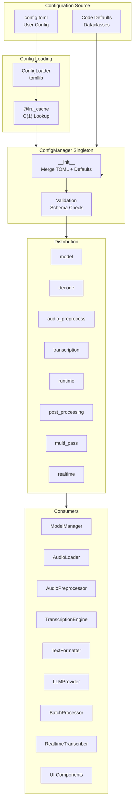

# Insightron Codebase Structure

## Overview

Insightron has been restructured into a modern, professional application architecture with clear separation of concerns and modular design.

## Directory Structure

```
Insightron/
├── insightron/                   # Main package (formerly src)
│   ├── app/                      # Application entry points
│   │   ├── main.py               # Main entry point (GUI + CLI logic)
│   │   ├── gui/                  # GUI application
│   │   │   └── main_window.py    # Main GUI window
│   │   └── cli/                  # CLI components
│   │       └── cli.py             # CLI application logic
│   ├── core/                     # Core functionality
│   │   ├── config.py             # Configuration management
│   │   ├── model_manager.py      # Whisper model management
│   │   ├── settings_manager.py   # User settings persistence
│   │   ├── utils.py              # Utility functions
│   │   ├── memory_monitor.py     # Memory monitoring
│   │   ├── resource_manager.py   # Efficiency Layer (CPU/RAM management)
│   │   └── vad.py                # Voice Activity Detection
│   ├── services/                 # Business logic services
│   │   ├── base_transcriber.py   # Ground Truth Layer (literal transcription)
│   │   ├── transcription/        # Transcription services
│   │   │   ├── transcribe.py     # Legacy wrapper (backward compat)
│   │   │   ├── transcription_engine.py # Single-Pass Brain
│   │   │   ├── audio_loader.py   # Audio loading & preprocessing
│   │   │   ├── audio_preprocessor.py # Audio preprocessing pipeline
│   │   │   ├── contracts.py      # Typed data contracts
│   │   │   ├── result_handler.py # Result formatting & saving
│   │   │   ├── markdown_renderer.py # Dashboard report renderer
│   │   │   ├── metrics_calculator.py # Word-level quality metrics
│   │   │   ├── text_formatter.py # FormattingView-based typesetter
│   │   │   ├── quality_metrics.py # Risk/quality scoring
│   │   │   ├── segment_analyzer.py # Adaptive segment merging
│   │   │   ├── diarization.py    # Speaker diarization (pyannote)
│   │   │   ├── speaker_attribution.py # Speaker labeling
│   │   │   ├── multi_pass_transcriber.py # Multi-pass orchestrator
│   │   │   ├── llm_provider.py   # LLM provider abstraction
│   │   │   └── emotion_analyzer.py # Emotion detection
│   │   ├── batch/                # Batch processing
│   │   │   ├── batch_processor.py
│   │   │   ├── batch_state_manager.py
│   │   │   └── progress_tracker.py
│   │   └── realtime/             # Real-time transcription
│   │       └── realtime_transcriber.py
│   └── ui/                       # UI components
│       ├── components/           # Reusable UI components (header, panels)
│       └── themes/               # Theme management
├── automation/                   # Automation scripts
│   ├── setup/                    # Installers (setup.py, install.py)
│   └── scripts/                  # Utilities (benchmark, troubleshooting)
├── docs/                         # Documentation
├── config.toml                   # Configuration file (TOML)
└── pyproject.toml                # Package configuration
```

## Architecture Diagram

```mermaid
%%{init: {'theme': 'base', 'themeVariables': { 'primaryColor': '#4a90d9', 'primaryTextColor': '#fff', 'primaryBorderColor': '#2c5f8d', 'lineColor': '#5c7080', 'secondaryColor': '#f5f5f5', 'tertiaryColor': '#e8f4f8'}}}%%
flowchart TB
    subgraph ROOT["Root Entry Points"]
        direction TB
        E1["insightron.py<br/>GUI Entry"]
        E2["cli.py<br/>CLI Entry"]
        E3["python -m<br/>insightron.app.main"]
    end

    subgraph CONFIG["Configuration System (config.toml)"]
        direction TB
        CFG["config.toml"]
        CL["ConfigLoader<br/>@cached O(1) lookup"]
        CM["ConfigManager<br/>Singleton"]
        subgraph CONFIGS["Config Dataclasses"]
            MC["ModelConfig"]
            DC["DecodeConfig"]
            APC["AudioPreprocessConfig"]
            TC["TranscriptionConfig"]
            RC["RuntimeConfig"]
            PPC["PostProcessingConfig"]
            MPC["MultiPassConfig"]
            RTC["RealtimeConfig"]
        end
    end

    subgraph APP["Application Layer (app/)"]
        direction TB
        MAIN["main.py<br/>Router"]
        GUI["gui/main_window.py<br/>CustomTkinter"]
        CLI["cli/cli.py"]
    end

    subgraph CORE["Core Layer (core/)"]
        direction TB
        MM["ModelManager<br/>Singleton"]
        RM["ResourceManager<br/>System Monitor"]
        VAD["VAD<br/>Voice Activity Detection"]
        MB["MessageBus<br/>Event System"]
        SM["SettingsManager"]
    end

    subgraph SERVICES["Services Layer (services/)"]
        direction TB
        BT["BaseTranscriber<br/>Ground Truth Layer"]
        
        subgraph TRANSCRIPTION["Transcription Pipeline"]
            direction TB
            AL["AudioLoader<br/>Signal Intake"]
            AP["AudioPreprocessor<br/>4-Stage Pipeline"]
            TE["TranscriptionEngine<br/>Single-Pass Brain"]
            
            subgraph MULTI_PASS["Multi-Pass Pipeline"]
                P1["Pass 1: Detection<br/>Whisper"]
                P2["Pass 2: Restoration<br/>LLM Provider"]
                P3["Pass 3: Emotion<br/>EmotionAnalyzer"]
                P1 --> P2 --> P3
            end
            
            subgraph OUTPUT["Output Handlers"]
                TF["TextFormatter<br/>Typesetter"]
                RH["ResultHandler<br/>Post-processing"]
                MR["MarkdownRenderer<br/>Dashboard Report"]
                MC["MetricsCalculator<br/>Quality Metrics"]
            end
            
            subgraph SPEAKER["Speaker Processing"]
                DI["Diarization<br/>pyannote"]
                SA["SpeakerAttribution"]
            end
        end
        
        subgraph BATCH["Batch Processing"]
            BP["BatchProcessor"]
            BSM["BatchStateManager"]
            PT["ProgressTracker"]
        end
        
        subgraph REALTIME["Realtime Transcription"]
            RT["RealtimeTranscriber"]
            RB["Ring Buffer"]
            EVAD["Energy VAD"]
        end
    end

    subgraph EXTERNAL["External Services"]
        WHISPER["faster-whisper<br/>WhisperModel"]
        LIBROSA["librosa<br/>Audio Processing"]
        NOISEREDUCE["noisereduce"]
        PLOUDNORM["pyloudnorm"]
        PYANNOTE["pyannote.audio"]
        LLM["Local/Cloud LLM"]
    end

    %% Connections - Entry to Config
    ROOT --> CONFIG
    CFG --> CL --> CM
    CM --> CONFIGS
    
    %% Connections - App to Core
    APP --> CORE
    MAIN --> GUI
    MAIN --> CLI
    MAIN --> WEB
    
    %% Connections - Core connections
    MM --> WHISPER
    RM --> MB
    CM --> MM
    CM --> RM
    
    %% Services connections
    CORE --> SERVICES
    AL --> AP
    AP --> BT
    BT --> WHISPER
    BT --> TE
    
    %% Single-Pass flow
    TE --> TF
    TF --> RH
    
    %% Multi-Pass flow
    TE --> MULTI_PASS
    MULTI_PASS --> LLM
    MULTI_PASS --> P3
    P3 --> RH
    
    %% Output handlers
    RH --> MR
    RH --> MC
    DI --> SA
    SA --> RH
    
    %% Batch processing
    BP --> BSM
    BP --> PT
    
    %% Realtime
    RT --> RB
    RT --> EVAD
    RT --> BT
    
    %% MessageBus connections
    MB -.->|"TRANSCRIPTION_STARTED"| MAIN
    MB -.->|"TRANSCRIPTION_PROGRESS"| MAIN
    MB -.->|"TRANSCRIPTION_COMPLETED"| MAIN
    MB -.->|"MODEL_LOADED"| MAIN
    MB -.->|"ERROR"| MAIN
```



### Detailed Data Flow

```mermaid
flowchart LR
    subgraph INPUT["Audio Input"]
        AI1["Single File"]
        AI2["Batch Files"]
        AI3["Live Microphone"]
    end
    
    subgraph LOAD["Audio Loading"]
        L1["librosa.load"]
        L2["Format Conversion"]
        L3["Resampling 16kHz"]
        L4["Mono Conversion"]
    end
    
    subgraph PREPROCESS["Audio Preprocessing"]
        P1["Noise Reduction<br/>noisereduce"]
        P2["LUFS Normalization<br/>pyloudnorm"]
        P3["Pre-emphasis Filter"]
        P4["Edge Trim"]
    end
    
    subgraph TRANSCRIBE["Transcription"]
        T1["BaseTranscriber<br/>Ground Truth"]
        T2["ModelManager<br/>Singleton"]
        T3["faster-whisper<br/>WhisperModel"]
        T4["Word Timestamps"]
        T5["Confidence Scores"]
    end
    
    subgraph REFINE["Refinement (Single-Pass)"]
        R1["Boundary Fixes"]
        R2["Light Normalization"]
        R3["Low-confidence Filter"]
        R4["Timestamp Adjustment"]
    end
    
    subgraph RESTORE["Multi-Pass (Optional)"]
        RST1["LLM Context<br/>Restoration"]
        RST2["Punctuation Fix"]
        RST3["Boundary Stitching"]
        RST4["Emotion Mapping"]
    end
    
    subgraph FORMAT["Text Formatting"]
        F1["FormattingView<br/>Selection"]
        F2["Punctuation<br/>Application"]
        F3["Paragraph/Bullet<br/>Layout"]
        F4["LaTeX Conversion"]
    end
    
    subgraph ANALYZE["Analysis"]
        A1["Speaker Diarization<br/>pyannote"]
        A2["Speaker Attribution"]
        A3["Quality Metrics"]
        A4["Confidence Analysis"]
    end
    
    subgraph OUTPUT["Output Generation"]
        O1["MarkdownRenderer<br/>Dashboard"]
        O2["ResultHandler<br/>File Save"]
        O3["Frontmatter"]
        O4["Quality Table"]
        O5["Speaker Timeline"]
    end
    
    %% Flow connections
    INPUT --> LOAD
    LOAD --> L1 --> L2 --> L3 --> L4 --> PREPROCESS
    PREPROCESS --> P1 --> P2 --> P3 --> P4 --> TRANSCRIBE
    TRANSCRIBE --> T1 --> T2 --> T3 --> T4 --> T5 --> REFINE
    REFINE --> R1 --> R2 --> R3 --> R4
    
    %% Decision for multi-pass
    REFINE -->|"Enabled"| RESTORE
    RESTORE --> RST1 --> RST2 --> RST3 --> RST4
    RESTORE --> FORMAT
    
    REFINE -->|"Disabled"| FORMAT
    
    FORMAT --> F1 --> F2 --> F3 --> F4 --> ANALYZE
    ANALYZE --> A1 --> A2 --> A3 --> A4 --> OUTPUT
    OUTPUT --> O1 --> O2 --> O3 & O4 & O5
```



### Configuration Flow



### Component Hierarchy

```mermaid
graph TB
    subgraph APPLICATION
        A1[insightron.py]
        A2[cli.py]
        A3[python -m insightron.app.main]
    end
    
    subgraph CORE["Core Layer"]
        C1[ConfigManager<br/>Singleton]
        C2[ModelManager<br/>Singleton]
        C3[ResourceManager<br/>Singleton]
        C4[MessageBus<br/>Singleton]
    end
    
    subgraph SERVICES["Service Layer"]
        S1[BaseTranscriber]
        S2[TranscriptionEngine]
        S3[MultiPassTranscriber]
        S4[AudioLoader]
        S5[AudioPreprocessor]
        S6[TextFormatter]
        S7[ResultHandler]
        S8[MarkdownRenderer]
        S9[MetricsCalculator]
        S10[Diarization]
        S11[SpeakerAttribution]
        S12[LLMProvider]
        S13[EmotionAnalyzer]
        S14[BatchProcessor]
        S15[RealtimeTranscriber]
    end
    
    subgraph UI["Presentation Layer"]
        U1[MainWindow]
        U2[FileSelector]
        U3[SettingsPanel]
        U4[ProgressPanel]
        U5[ResultsPanel]
        U6[AudioVisualizer]
        U7[ThemeManager]
    end
    
    APPLICATION --> CORE
    CORE --> SERVICES
    SERVICES --> UI
```



## Module Purposes

### `insightron/app/`
**Purpose**: Application entry points and main application logic.
- **`main.py`**: Initializes the application context and validation.
- **`gui/`**: Contains the CustomTkinter GUI logic.
- **`cli/`**: Contains the argparse CLI logic.

### `insightron/core/`
**Purpose**: Core functionality and foundational components.
- **`config.py`**: Typesafe configuration management using `ConfigManager`.
- **`model_manager.py`**: Central singleton for model loading and inference.
- **`resource_manager.py`**: Handles dynamic resource allocation and constraints.
- **`vad.py`**: Configurable Voice Activity Detection logic.

### `insightron/services/`
**Purpose**: Pure business logic, independent of UI.
- **`base_transcriber.py`**: Ground Truth Layer — camera-like literal transcription with resource validation.
- **`transcription/`**:
    - **`transcription_engine.py`**: Single-Pass Brain — refines literal output into a usable first draft.
    - **`audio_loader.py`**: Robust audio loading with format conversion.
    - **`audio_preprocessor.py`**: 4-stage audio preprocessing (noise reduction, LUFS, pre-emphasis, trim).
    - **`contracts.py`**: Typed frozen dataclasses for pipeline data (`SegmentData`, `TranscriptionMetrics`, etc.).
    - **`result_handler.py`**: Manages output generation with formatting profiles and dashboard/classic reports.
    - **`markdown_renderer.py`**: Dashboard-style Markdown reports with quality metrics and speaker timelines.
    - **`metrics_calculator.py`**: Word-level and temporal quality metrics computation.
    - **`text_formatter.py`**: FormattingView-based typesetter with named views and LaTeX support.
    - **`diarization.py`**: pyannote speaker diarization wrapper.
    - **`speaker_attribution.py`**: Overlap-based speaker labeling for segments and words.
    - **`llm_provider.py`**: v2 LLM restoration with prompt profiles and JSON response contract.
    - **`emotion_analyzer.py`**: Emotion detection with configurable thresholds.
- **`batch/`**: Manages multi-processing/threading for bulk files.
- **`realtime/`**: Audio stream capturing and live transcription.

## Import Patterns

All imports now use absolute paths rooted at the `insightron` package:

### Core Modules
```python
from insightron.core.config import ConfigManager, get_config_manager
from insightron.core.model_manager import ModelManager
```

### Services
```python
from insightron.services.transcription.transcribe import AudioTranscriber
from insightron.services.batch.batch_processor import batch_transcribe_files
```

## Running the Application

### GUI Mode
```bash
python -m insightron.app.main
```

### CLI Mode
```bash
python -m insightron.app.cli.cli --help
```

### Batch Mode
```bash
python -m insightron.app.main batch -i /path/to/audio
```

### System Check
```bash
python -m insightron.app.main --check
```

## Migration Notes (v4.1.1)

- All v4.1.0 features remain intact in v4.1.1
- Minimal Architecture refinements with optimized data flow
- Enhanced quality metrics and memory efficiency improvements
- The `src` directory was renamed to `insightron` in v4.0.0
